# Certificate Management System - Data Flow Diagrams & Flowcharts

## 🔄 System Data Flow Diagram (Level 0 - Context)

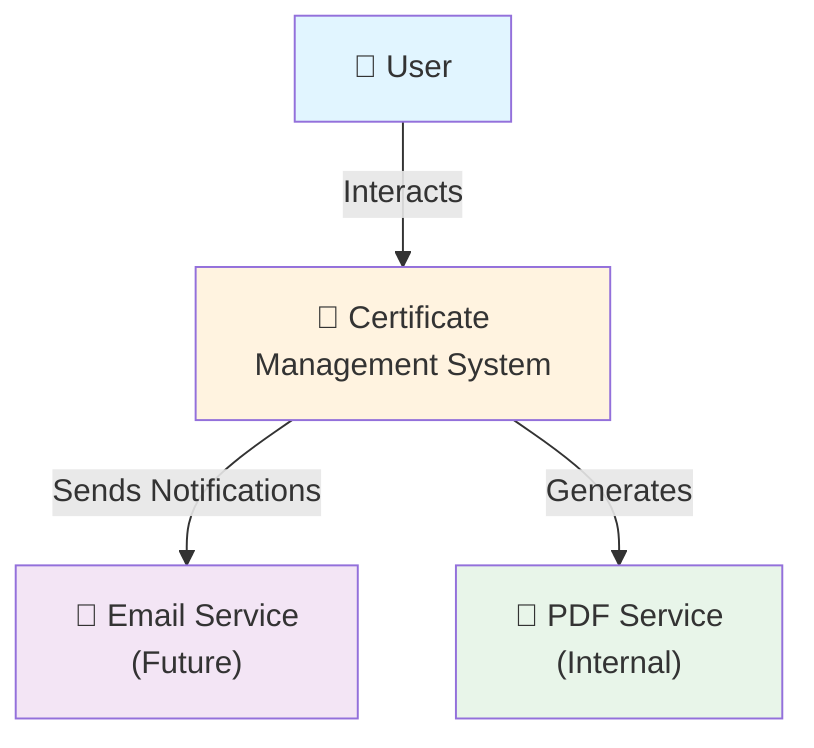

---

## 📊 Level 1 DFD - Main Processes

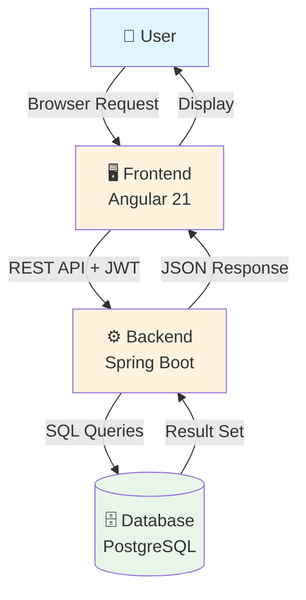

---

## 🔐 Authentication Data Flow

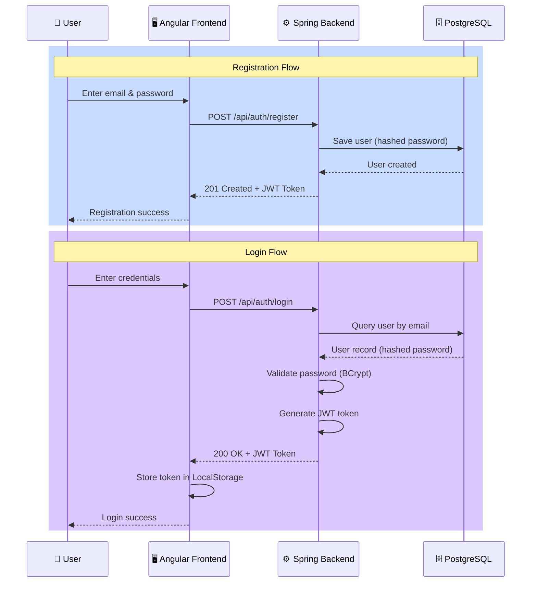

---

## 📝 Template Creation & Certificate Generation Flow

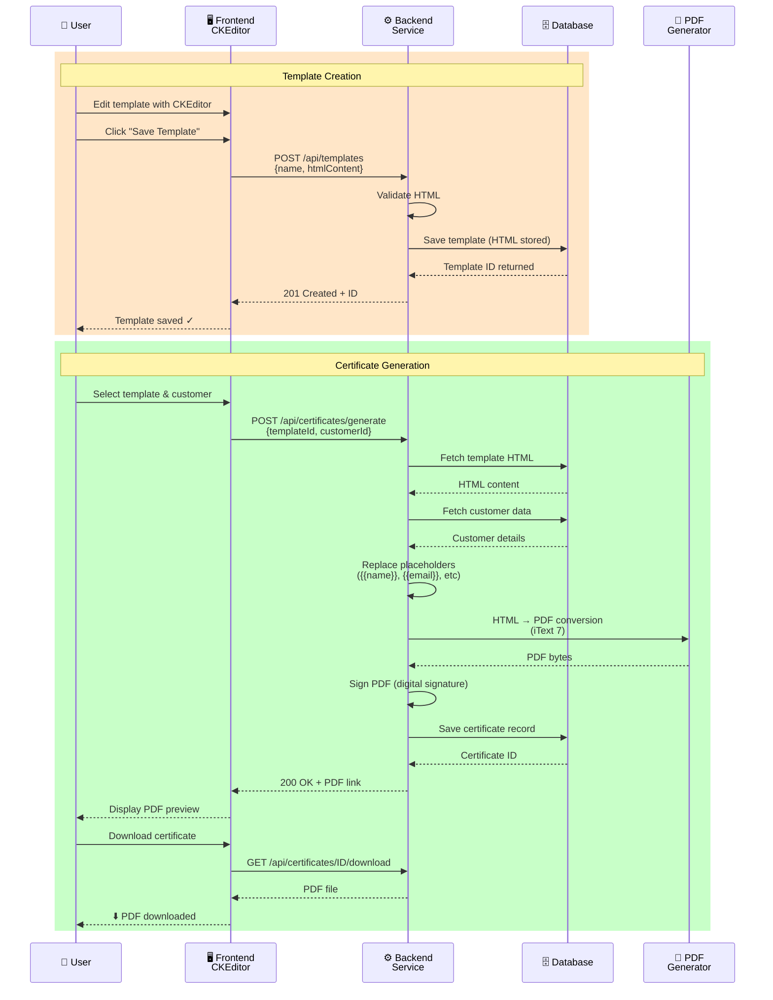

---

## 🗄️ Data Flow - Database Operations

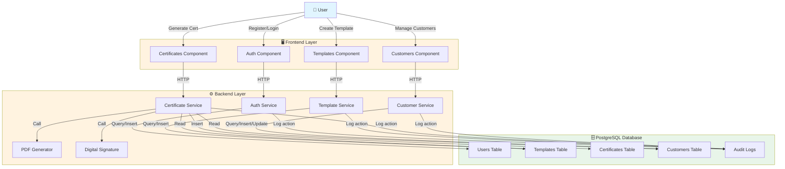

---

## 🔄 Certificate Generation Process Flow

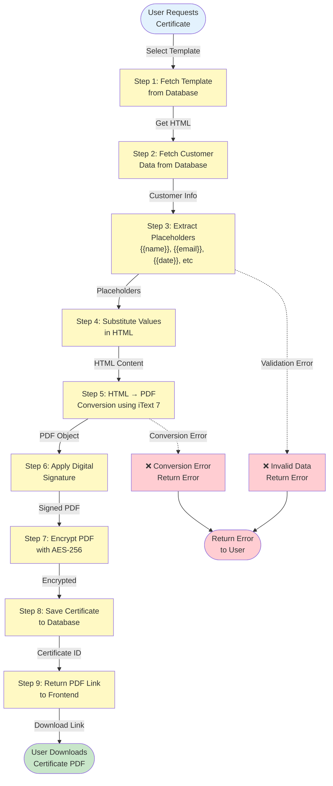

---

## 🔐 Security & Authentication Flow

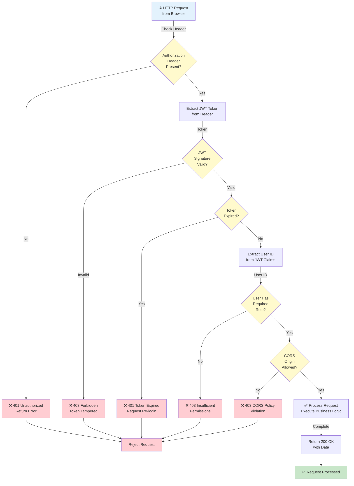

---

## 🌐 Request-Response Cycle DFD

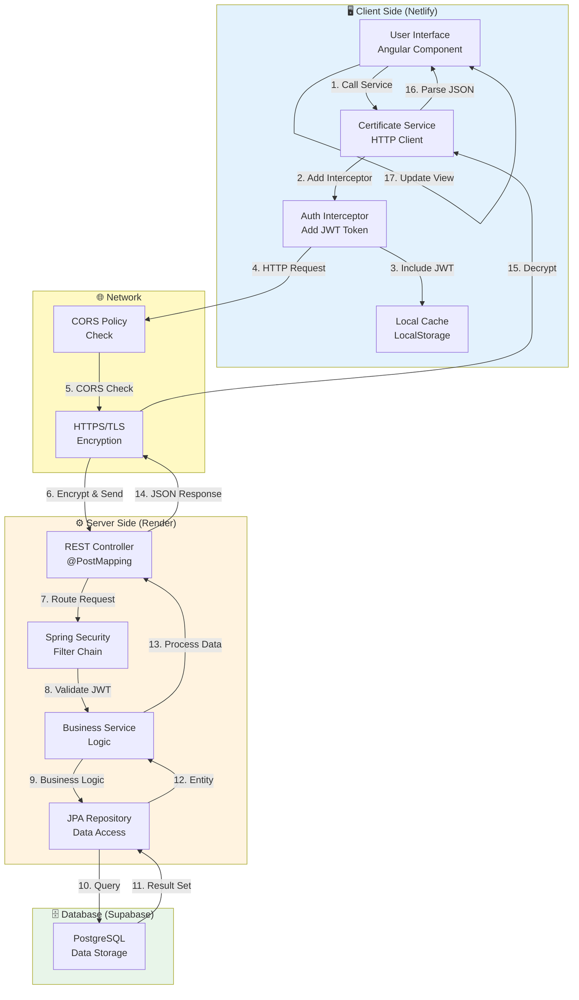

---

## 📊 CKEditor Template Editing Flow

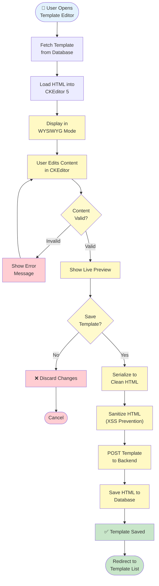

---

## 🚀 Deployment Pipeline Flow

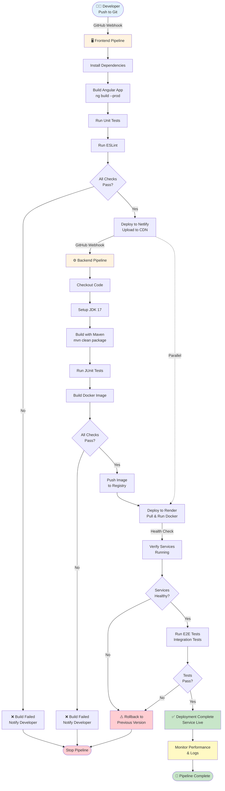

---

## 🔄 Data Synchronization Flow

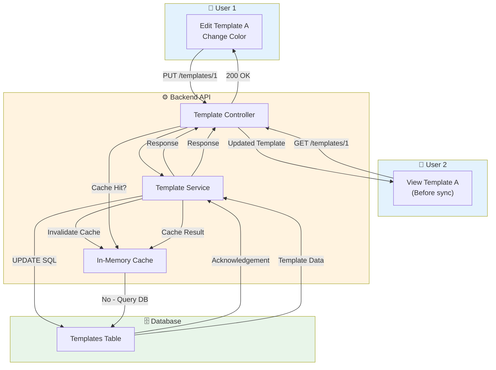

---

## 📈 Performance Monitoring Flow

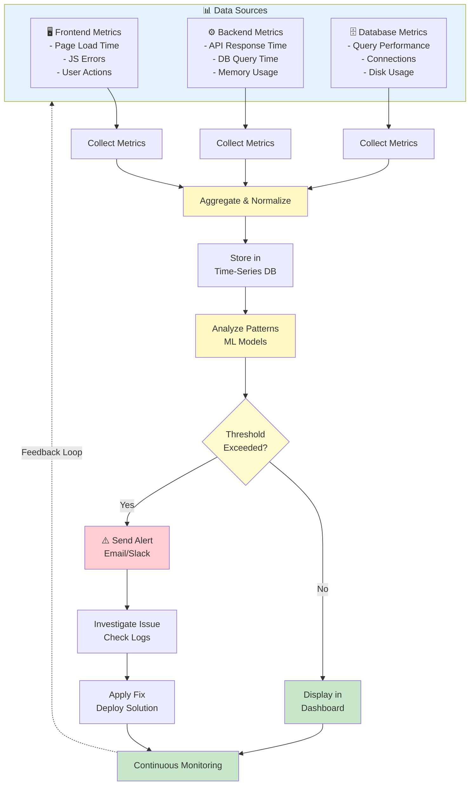

---

## 🔒 Backup & Recovery Flow

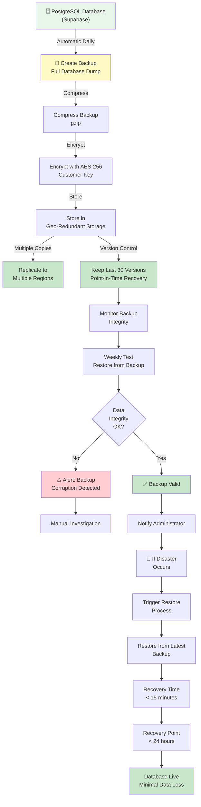

---

## 🎯 Error Handling & Recovery Flow

```mermaid
flowchart TD
    Request["🌐 User Request"]
    
    Request --> Try["Try: Execute Operation"]
    
    Try --> Execute["Perform Business Logic"]
    
    Execute --> Catch{"Exception<br/>Caught?"}
    
    Catch -->|No| Success["✅ Success"]
    Success --> Log1["Log Success Event"]
    Log1 --> Return["Return 200 + Data"]
    Return --> End1(["Response to User"])
    
    Catch -->|Yes| Identify["Identify Exception<br/>Type"]
    
    Identify --> Type1{"Exception<br/>Type?"}
    
    Type1 -->|Validation Error| Val["❌ Validation Failed"]
    Val --> LogVal["Log Warning"]
    LogVal --> ReturnVal["Return 400<br/>Bad Request"]
    
    Type1 -->|Database Error| DB["❌ Database Error"]
    DB --> LogDB["Log Error<br/>Stack Trace"]
    LogDB --> ReturnDB["Return 500<br/>Internal Error"]
    
    Type1 -->|Auth Error| Auth["❌ Authorization Failed"]
    Auth --> LogAuth["Log Security Event"]
    LogAuth --> ReturnAuth["Return 403<br/>Forbidden"]
    
    Type1 -->|Resource Not Found| NotFound["❌ Resource Missing"]
    NotFound --> LogNotFound["Log Info"]
    LogNotFound --> ReturnNotFound["Return 404<br/>Not Found"]
    
    Type1 -->|Timeout| Timeout["❌ Operation Timeout"]
    Timeout --> LogTimeout["Log Timeout"]
    LogTimeout --> ReturnTimeout["Return 503<br/>Service Unavailable"]
    
    ReturnVal --> Finally["Finally Block:<br/>Cleanup Resources"]
    ReturnDB --> Finally
    ReturnAuth --> Finally
    ReturnNotFound --> Finally
    ReturnTimeout --> Finally
    
    Finally --> Cleanup["Close DB Connections<br/>Release Memory"]
    
    Cleanup --> Alert{"Critical<br/>Error?"}
    
    Alert -->|Yes| SendAlert["⚠️ Send Alert<br/>to Ops Team"]
    Alert -->|No| Dashboard["Log to Dashboard"]
    
    SendAlert --> Monitor["Monitor for<br/>Patterns"]
    Dashboard --> Monitor
    
    Monitor --> End2(["Response to User"])
    End1 --> end(["Complete"])
    End2 --> end
    
    style Success fill:#c8e6c9
    style Val fill:#ffcdd2
    style DB fill:#ffcdd2
    style Auth fill:#ffcdd2
    style NotFound fill:#ffcdd2
    style Timeout fill:#ffcdd2
    style SendAlert fill:#ffcdd2
    style End1 fill:#c8e6c9
    style End2 fill:#c8e6c9
```

---

## 📤 Certificate Download & Delivery Flow

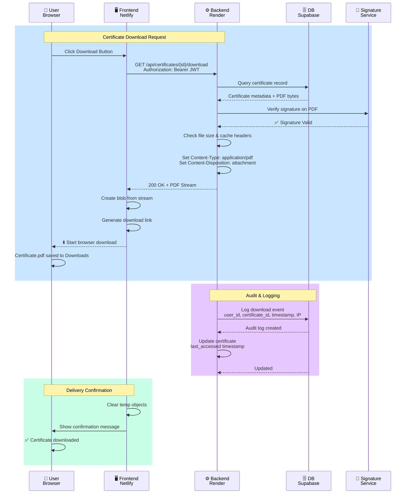

---

## 🔍 Template Search & Filter Flow

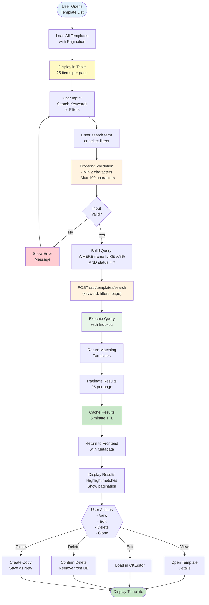

---

## 📋 Summary Table - DFD Components

| Component | Location | Data In | Data Out | Function |
|-----------|----------|---------|----------|----------|
| **User** | Browser | None | Actions | Initiates requests |
| **Angular Frontend** | Netlify | HTTP responses | HTTP requests + JWT | UI & client logic |
| **Spring Backend** | Render | DB queries | REST responses | Business logic |
| **PostgreSQL** | Supabase | Insert/Update/Delete | Query results | Data persistence |
| **CKEditor** | Frontend | HTML content | Serialized HTML | Template editing |
| **iText PDF** | Backend | HTML + data | PDF bytes | PDF generation |
| **Digital Signature** | Backend | PDF bytes + private key | Signed PDF | Certificate signing |
| **JWT Token** | Network | Credentials | Authorization header | Authentication |

---

## 🎯 How to Use These Diagrams

### Option 1: View on GitHub
- These Mermaid diagrams render automatically on GitHub
- View the raw markdown file to see the diagram syntax
- Great for documentation & code review

### Option 2: Export as Images
```bash
# Install mermaid-cli
npm install -g @mermaid-js/mermaid-cli

# Convert to PNG
mmdc -i ARCHITECTURE_DFD_FLOWCHARTS.md -o architecture_diagrams.png

# Convert to SVG
mmdc -i ARCHITECTURE_DFD_FLOWCHARTS.md -o architecture_diagrams.svg
```

### Option 3: Embed in Google Slides
1. Export each diagram as SVG
2. Insert SVG image into Google Slides
3. Select & right-click → "Edit image" for unlimited editing

### Option 4: Use Mermaid Live Editor
1. Go to [https://mermaid.live](https://mermaid.live)
2. Paste diagram code
3. Export as PNG/SVG
4. Insert into presentations

### Option 5: Convert to PDF
```bash
# Using headless Chrome
node -e "require('puppeteer')" && \
google-chrome --headless --print-to-pdf architecture_diagrams.pdf
```

---

## 🎨 Diagram Style Guide

**Colors Used:**
- 🔵 **Light Blue** (`#e3f2fd`) - Start/End, User, Client-side
- 🟡 **Light Yellow** (`#fff9c4`, `#fffacd`) - Process, Decision, Server-side
- 🟠 **Light Orange** (`#fff3e0`) - API, Services
- 🟢 **Light Green** (`#e8f5e9`, `#c8e6c9`) - Database, Success, Complete
- 🔴 **Light Red** (`#ffcdd2`) - Errors, Failures, Blocked

**Symbols:**
- 👤 = User/Actor
- 🖥️ = Frontend
- ⚙️ = Backend/Service
- 🗄️ = Database
- 🌐 = Network/Internet
- 📄 = Files/PDF
- 🔐 = Security
- ✅ = Success
- ❌ = Failure
- ⚠️ = Warning/Alert

